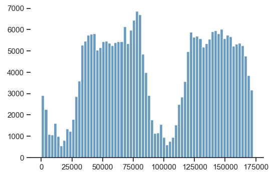
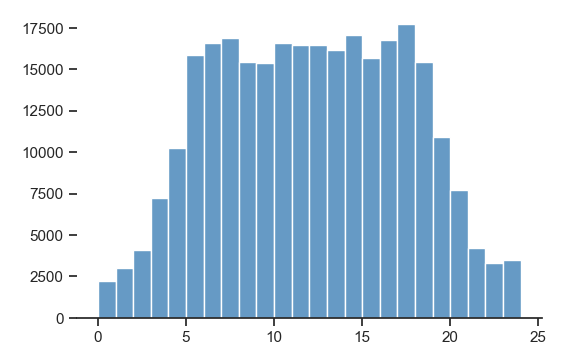
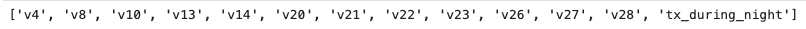
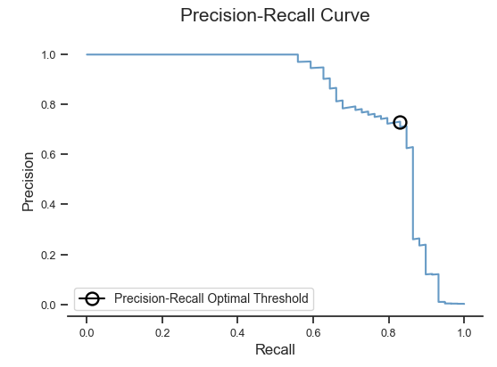
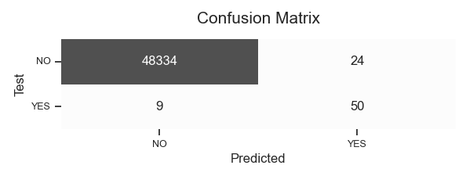

## Credit Card Fraud Detection (in process)

**Стек:** Python, Numpy, Pandas, Sklearn, Tensorflow, Seaborn

### Краткое описание проекта

https://www.kaggle.com/datasets/mlg-ulb/creditcardfraud

### Начальные данные

В датасете представлены транзакции по кредитнымм картам за двое суток. Из 284 807 транзакций 492 являются мошенническими, что составляет 0,172%.

Количественные признаки V1-V28 отобраны с помощью алгоритма PCA. Наименования признаков зашифрованы из соображения конфиденциальности. Также в датасете присутствуют признаки time (время совершения транзакции - число секунд, прошедших с момента совершения первой транзакции) и amount (сумма).

Признак class - целевая переменная, положительной исход - это мошенническая операция.

### Преобразование переменной time

В литературе отмечается, что мошеннические операции совершаются преимущественно в ночное время (12 a.m. - 6 a.m.). Можно предположить, что дополнительный признак tx_during_night (транзакция совершена ночью) увеличит эффективность модели. 

Помимо этого известно, что наименьшее число операций по кредитным картам приходится на 12 a.m. Зная это, можно определить приблизительное время совершения каждой транзакции. 

**Переменная time** (исходные данные, ось X - время в секундах с момента совершения первой транзакции)

**Переменная time** (преобразованные данные, ось X - часы)

### Модель в первой итерации

С помощью логистической регрессии производится отбор признаков. В итоговый список попадают признаки, повышающие эффективность модели. 

Пока рабочей моделью является нейронная сеть с двумя скрытыми слоями. Пока модель демонстрирует невысокий precision: при 85% выявленных мошеннических операциях, 24 из 74 операций, помеченных как мошеннические, таковыми не являются. 

